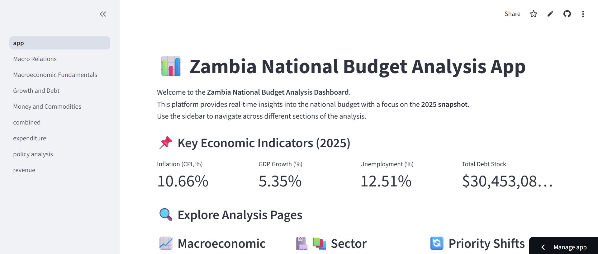

# Zambia Budget Analysis App

**Author:** Kampamba Shula  
**Platform:** Python + Streamlit + Plotly  
**Purpose:** Analyze and visualize Zambia’s budget (2007–2025), including revenue, expenditure, fiscal deficit, and government budget constraints.  

---

**BudgetPulse Zambia** is an interactive Streamlit dashboard designed to provide insights into Zambia’s national budget, macroeconomic trends, money supply, and commodity markets. The platform allows policymakers, researchers, and analysts to visualize historical data and understand fiscal dynamics to inform decision-making.

---

## Features

### 📊 Macroeconomic Fundamentals

- Visualize **GDP growth**, **inflation**, and **debt stock** over time.
- Plot fiscal indicators including deficits and debt-to-GDP ratios.
- Interactive line charts with commentary to aid interpretation.

### 💰 Money & Commodities

- Track **narrow money**, **broad money (M2, M3)** trends and their economic implications.
- Monitor commodity prices such as **copper**, **cobalt**, **crude oil**, and **maize**.
- Separate plots for each commodity for detailed analysis.

### 📈 Phillips Curve

- Explore the relationship between **unemployment** and **inflation** in Zambia.

- Visualize trends that indicate inflation expectations and labor market pressures.
- Policy-relevant insights for macroeconomic stabilization.

### 📊 GDP Analysis

- Examine **GDP trends over time**.
- Assess the impact of population growth, labor participation, and sectoral performance.

### 🔎 Correlation Heat Maps

- Identify relationships between key variables such as **money supply**, **debt stock**, **exchange rates**, and **inflation**.
- Helps detect fiscal vulnerabilities and areas requiring policy attention.

---
---

